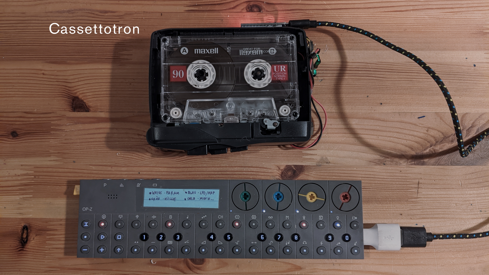
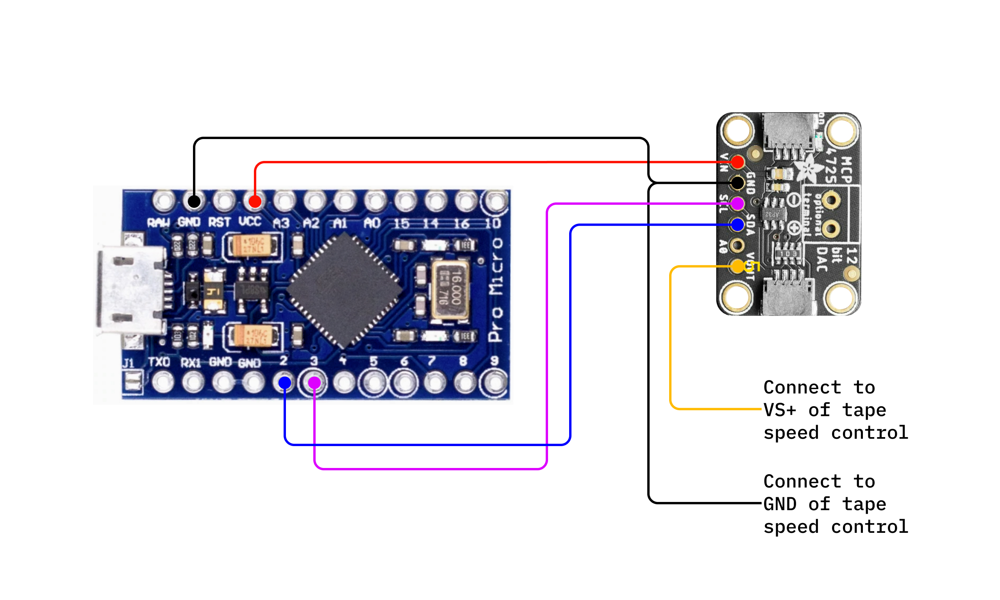

Cassettotron
---

### Control a cassette player via USB-MIDI

v0.1.0

This is my flavor of the well troden controlling of cassette players for musical effect. I wanted everything self contained on the microcontroller to take advantage of USB-MIDI — specifically via the OP-Z, Ableton, Norns, etc.

[Zach Scholl's tape synth](https://schollz.com/blog/tape-synth/) was where I started, but he uses a browser based means to interface with devices.  [Adafruit's Walkmellotron](https://learn.adafruit.com/walkmellotron/walkmellotron-midi-controlled-tape-player) was also clearly strongly referenced, but I prefer Arduino/C++/Platformio1. And of course the [Onde Magentétique](http://www.ondemagnetique.com/), but as Zack also notes it's hard to find and it also lacks direct MIDI control.

1 only because of my surplus of Arduino/Platformio compatible boards.

---
### ☂️ Preparation

**Install PlatformIO**

This project uses [PlatformIO](https://platformio.org/) for compilation and flashing. Install is pretty painless, here are [step-by-step directions for VSCode](https://platformio.org/install/ide?install=vscode).

---
### ⚡️ Compiling and Flashing

| Platform          | Commands                                        |
| ----------------- | ----------------------------------------------- |
| Arduino Pro Micro | `$ ./build.sh` or `$ ./build.sh pro-micro`                        |

---
### 📼 Hardware

**BOM**

| Item | Qty | Price |
| ---- | --- | ----- |
| [5V Pro Micro](https://www.sparkfun.com/products/12640)2  or any microcontroller with [ATmega32U4](https://www.microchip.com/en-us/product/ATmega32U4) chip | 1 | $19.50 |
| [MCP4725 12-Bit DAC with I2C Interface](https://www.adafruit.com/product/935) | 1 | $4.95 |
| [STEMMA QT / Qwiic JST SH 4-pin](https://www.adafruit.com/product/4209) (optional) | 1 | $0.95 |
| [GE 3-5362A Cassette Player/Recorder](https://www.ebay.com/sch/i.html?_from=R40&_trksid=p2380057.m570.l1313&_nkw=GE+3-5362A&_sacat=0) or any cassette player with speed control | 1 | $10–$20 |

2 [clones](https://www.aliexpress.com/w/wholesale-arduino-pro-micro.html) work just as well and are a fare bit cheaper.

**Hacking the hardware**

Instead of detailing out here how and where to hack everything together. Just follow the guidance for [Adafruit's Walkmellotron](https://learn.adafruit.com/walkmellotron/build-the-walkmellotron). The significant departure is my code is C++ (Arduino flavor) and uses a Pro Micro.

---
### References

- http://www.ondemagnetique.com/
- https://schollz.com/blog/tape-synth/
- https://learn.adafruit.com/mcp4725-12-bit-dac-tutorial/pinouts
- https://learn.adafruit.com/walkmellotron/walkmellotron-midi-controlled-tape-player
- https://github.com/dlynch7/MIDI2CV/blob/master/arduino/midi2pitchvelcv.ino
- https://www.instructables.com/Another-MIDI-to-CV-Box-/
- https://learn.sparkfun.com/tutorials/pro-micro--fio-v3-hookup-guide/hardware-overview-pro-micro
- https://learn.sparkfun.com/tutorials/mcp4725-digital-to-analog-converter-hookup-guide?_ga=2.266092367.1379041089.1665742907-687045790.1655520030&_gac=1.253447675.1664901297.CjwKCAjws--ZBhAXEiwAv-RNLxT1Ol8tYm_PkuOTt1EH5tQFU9bTH4QvtzIU3BcFZRBBi3jo2xX8KRoCHscQAvD_BwE
- https://www.guerrilladigital.cc/2021/03/10/i-spent-the-last-two-weeks-researching-and-making-endless-cassette-loop-tapes-and-this-is-what-i-learned/